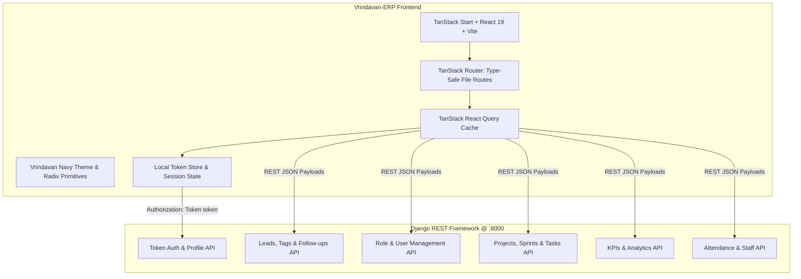
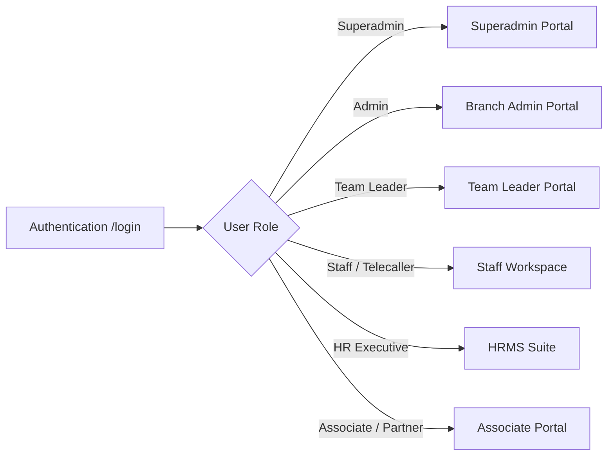

# Vrindavan-ERP: Master Technical Specification & Architecture Documentation

## 1. Executive Summary

**Vrindavan-ERP** is an enterprise-grade, multi-role Real Estate Enterprise Resource Planning and Customer Relationship Management (CRM) platform. It merges high-performance property inventory operations with live telecalling sales CRM, agile project management (PMS), and human resource attendance tracking (HRMS).

### Core Pillars
1. **Real Estate Operations**: Land parcels, apartment buildings, commercial spaces, flat unit boundaries, and booking disbursement.
2. **Multi-Role Telecalling CRM**: Active call disposition (Interested, Follow-up, Not Picked, Site Visit, Lost) with team delegation and timeline tracking.
3. **Agile PMS**: Jira/Linear-style sprint cycles, Kanban task progression, burndown analytics, and velocity metrics.
4. **HRMS & Attendance**: Employee directory, smart ID card studio, shift scheduling, and manual attendance marking.
5. **Channel Partner & Associate Network**: MLM associate hierarchy tree, commissions calculation, and performance reports.

---

## 2. System Architecture



### Technology Stack Comparison & Mapping

| Component | Legacy CrmAttendance2 | Vrindavan-ERP Target | Benefit |
| :--- | :--- | :--- | :--- |
| **Framework** | Next.js 13/14 (App Router) | TanStack Start + Vite | Faster HMR, zero server bundle bloat |
| **Language** | TypeScript / React 18 | TypeScript / React 19 | Latest concurrent features & performance |
| **Styling** | Tailwind CSS v3 + CSS vars | Tailwind CSS v4 + Inline Theme | Modern CSS engine, uniform enterprise tokens |
| **Routing** | File-based `page.tsx` | `@tanstack/react-router` | Full TypeScript type safety for params & search |
| **Data Fetching** | Raw `fetch` inside client components | TanStack Query (`useQuery`, `useMutation`) | Instant caching, background refetch, zero stale bugs |
| **Backend API** | Django REST (`http://127.0.0.1:8000`) | Django REST (`http://127.0.0.1:8000`) | Direct API reuse with zero backend rewrite |

---

## 3. Role-Based Access Control (RBAC) & Portals

Vrindavan-ERP partitions features into 6 role-based interfaces with seamless global navigation:



### 1. Superadmin Portal
* **Responsibilities**: Full tenant administration, company-wide revenue & earnings, system audit logs, and global user provisioning.
* **Key Pages**:
  * Global Dashboard (`/`)
  * User Management: Admin, Team Leader, Staff, HR, IT Staff, Associates (`/admin/manage-users`)
  * Global Lead Allocation & Uploads (`/superadmin/leads`, `/superadmin/upload-leads`)
  * Company Productivity & Financial Reports (`/admin/reports/...`)

### 2. Admin Portal
* **Responsibilities**: Operational branch supervision, staff assignment, lead monitoring, and master table maintenance.
* **Key Pages**:
  * Branch Leads & Timeline (`/leads`, `/admin/leads/timeline`)
  * Masters: Inquiry status, Sources, Localities, Budgets, Brokers (`/admin/masters/...`)
  * Real Estate: Apartments, Plots, Rowhouses, Inventory (`/admin/projects/...`)

### 3. Team Leader (TL) Portal
* **Responsibilities**: Team sales quotas, subordinate lead assignments, calling performance reviews, and team member incentives.
* **Key Pages**:
  * Team Dashboard & Active Leads (`/team-leader/dashboard`, `/team-leader/leads`)
  * Lead Distribution & Re-assignment (`/team-leader/leads/staff`)
  * Subordinate Performance & Timesheets (`/team-leader/team`, `/team-leader/timesheet`)

### 4. Staff / Telecaller Workspace
* **Responsibilities**: High-velocity daily calling, lead status transitions, scheduling site visits, and logging call outcomes.
* **Key Pages**:
  * Calling Queue: Today Follow-ups, Tomorrow Follow-ups, Pending (`/staff/reports/...`)
  * Lead Disposition Modal: Instant status updates (Interested, Visit, Not Picked, Lost)
  * Personal Profile, Attendance Overview & Incentives (`/staff/overview`, `/staff/earn`)

### 5. HRMS & Attendance Suite
* **Responsibilities**: Employee lifecycle management, asset tracking, shift management, and manual attendance verification.
* **Key Pages**:
  * Employee Directory & Profiles (`/hr/employees`)
  * ID Studio: Employee badge preview and printable rendering (`/hr/employees/id-studio`)
  * Manual Attendance Marker: Date, check-in, check-out, status (`/hr/attendance/manual`)
  * Shift Scheduler & Leave Management (`/hr/shifts`, `/hr/leaves`)

### 6. PMS (Agile Project Management) Suite
* **Responsibilities**: Software/Construction milestones, sprint tracking, and Kanban backlog.
* **Key Pages**:
  * PMS Dashboard: Sprint velocity, active sprint timeline, burndown charts (`/pms`)
  * Sprints & Backlog: Milestone creation, sprint planning (`/pms/sprints`)
  * Drag-and-Drop Kanban Task Board: To Do, In Progress, Review, Done, Blocked (`/pms/tasks`)

---

## 4. API Specification & Integration Catalog

All requests to the backend Django service at `http://127.0.0.1:8000` authenticate using:
```http
Authorization: Token <authToken>
Content-Type: application/json
```

### Module A: Authentication & User Management

| API Function | Endpoint | Method | Description |
| :--- | :--- | :---: | :--- |
| `toggleUserActiveStatus` | `/accounts/users/toggle-active/` | POST | Toggles user status between active and inactive |
| `fetchCurrentUserProfile` | `/accounts/profile/` | GET | Fetches profile, role, avatar, and assigned branch |
| `fetchAdmins` | `/accounts/admins/` | GET | Returns list of administrative accounts |
| `fetchTeamLeaders` | `/accounts/team-leaders/` | GET | Returns all active team leaders |
| `editTeamLeader` | `/accounts/team-leader/${id}/` | PUT/PATCH | Updates team leader configurations & team mapping |
| `fetchUsers` | `/accounts/users/` | GET | Returns system users with role filters |

### Module B: Lead Pipeline & Telecalling Workflow

| API Function | Endpoint | Method | Description |
| :--- | :--- | :---: | :--- |
| `fetchAdminLeadsByTag` | `/accounts/admin-leads/${tag}/` | GET | Retrieves admin leads filtered by tag (`interested`, `visit`, etc.) |
| `updateLeadStatusAndFollowUp`| `/accounts/lead/status-and-followup/` | POST | Updates lead status, next call time, and disposition notes |
| `fetchSuperuserStaffLeadsByTag`| `/accounts/superuser/staff-leads/` | GET | Superuser view of all staff leads by category |
| `fetchSuperuserTeamLeaderLeads`| `/accounts/superuser/team-leader-leads/` | GET | Superuser view of team-leader allocated leads |
| `fetchLeadsForStaff` | `/accounts/leads-for-staff/` | GET | Fetches authenticated telecaller's calling leads queue |
| `fetchLeadHistory` | `/accounts/lead-history/` | GET | Returns complete calling history and audit trail |
| `fetchAdminLeadHistoryById` | `/accounts/admin/lead-history/` | GET | Detailed activity history for a specific lead ID |
| `fetchTeamLeaderVisitLeads` | `/accounts/team-leader/visit-leads/` | GET | Site visit confirmed leads for team leader |
| `exportTeamLeaderLeads` | `/accounts/team-leader/export-leads/` | POST | Generates CSV export for team leads |
| `addAdminLead` | `/accounts/admin/add-lead/` | POST | Creates a new incoming sales lead |

### Module C: Agile PMS (Project Management System)

| API Function | Endpoint | Method | Description |
| :--- | :--- | :---: | :--- |
| `fetchProjects` | `/projects/` | GET | Retrieves list of PMS projects |
| `createSprint` | `/sprints/` | POST | Creates a new sprint cycle with date ranges |
| `fetchSprints` | `/sprints/` | GET | Fetches active and previous sprints for a project |
| `createMilestone` | `/milestones/` | POST | Defines project deliverables and target milestones |
| `fetchMilestones` | `/milestones/` | GET | Retrieves all milestones and completion percentages |
| `createTask` | `/tasks/` | POST | Creates a backlog/sprint task with assignee & story points |
| `moveTaskApi` | `/tasks/${id}/move/` | POST/PATCH | Updates task column (`to_do`, `in_progress`, `review`, `done`, `blocked`) |
| `getTaskComments` | `/tasks/${id}/comments/` | GET | Retrieves threaded discussion on a task |
| `createTaskComment` | `/tasks/${id}/comments/` | POST | Adds comment/attachment to task |
| `fetchSprintBurndownData` | `/sprints/${id}/burndown/` | GET | Returns story point burndown curve data |
| `fetchSprintCapacityVelocity`| `/sprints/${id}/velocity/` | GET | Sprint velocity and team capacity analytics |
| `fetchActiveDashboardTasks` | `/tasks/dashboard/` | GET | Active sprint summary for dashboard widget |
| `fetchUpcomingDeadlines` | `/tasks/deadlines/` | GET | Tasks due within the next 48-72 hours |
| `fetchTeamWorkload` | `/tasks/workload/` | GET | Distribution of assigned tasks across developers/engineers |

---

## 5. Visual Design System & Branding Tokens

Vrindavan-ERP adheres to an authoritative, enterprise navy aesthetic configured in `styles.css`:

### Color Tokens
* **Navy Background (`--color-navy`)**: `#111827` / `#0f172a` — Deep luxurious container background.
* **Navy Deep (`--color-navy-deep`)**: `#0b0f19` — Sidebar background.
* **Brand Primary (`--color-brand`)**: `#4f46e5` to `#6732f2` — Electric indigo brand identity.
* **Brand Bright (`--color-brand-bright`)**: `#6366f1` — Interactive hover state.
* **Brand Soft (`--color-brand-soft`)**: `rgba(99, 102, 241, 0.12)` — Subtle active pill highlights.
* **Status Success (`--color-success`)**: `#10b981` — Converted leads, present attendance, done tasks.
* **Status Warning (`--color-warning`)**: `#f59e0b` — Follow-up required, in-progress tasks.
* **Status Danger (`--color-danger`)**: `#ef4444` — Lost leads, absent attendance, blocked tasks.
* **Status Info (`--color-info`)**: `#3b82f6` — Site visits scheduled, review tasks.

### Typography & Surfaces
* **Font Family**: `"Inter", system-ui, -apple-system, BlinkMacSystemFont, "Segoe UI", sans-serif`
* **Card Surface**: Uniform `rounded-[14px]` with `border border-border/60` and subtle elevation shadow.
* **Buttons**: Rounded `rounded-[10px]` with clear visual hierarchy (Primary Brand, Outline, Ghost, Danger).

---

## 6. Directory & Code Organization

```
d:\Crm\Vrindavan\Suryax-Erp\
├── docs/                                  # Master Architecture & API Documentation
│   └── VRINDAVAN_ERP_DOCUMENTATION.md     # This specification
├── src/
│   ├── assets/                            # Brand logos, project imagery
│   ├── components/
│   │   ├── crm/                           # Lead disposition modals, calling tables
│   │   ├── dashboard/                     # Executive dashboard & AI assistant
│   │   ├── erp/                           # Reusable CrudPage, DataTable, RecordModal
│   │   ├── forms/                         # Employee, Sprint, Task, Project dialogs
│   │   ├── hrms/                          # ID studio canvas, attendance punches
│   │   ├── layout/                        # AppShell, Navbar, Sidebar with role switcher
│   │   ├── pms/                           # Kanban board, burndown charts, sprints
│   │   └── ui/                            # 46 Radix UI primitives
│   ├── lib/
│   │   ├── erp/                           # Real estate schemas, nav config, local store
│   │   ├── services/                      # Live Django API services & Auth manager
│   │   │   ├── api.ts                     # 60+ API functions with type declarations
│   │   │   └── auth.ts                    # Token session & role state
│   │   └── utils.ts                       # Class merging (cn)
│   └── routes/                            # TanStack Router file-based pages
│       ├── __root.tsx                     # Global AppShell wrapper
│       ├── index.tsx                      # Dashboard root
│       ├── login.tsx                      # Luxury Token Auth login
│       ├── admin/                         # Admin & Superadmin management
│       ├── hr/                            # HRMS, Shifts, ID Studio, Attendance
│       ├── pms/                           # Projects, Sprints, Kanban Board
│       ├── staff/                         # Telecalling CRM workspace
│       └── team-leader/                   # Team leader management
└── package.json                           # Bun / Vite / React 19 dependencies
```

---

## 7. Migration & Quality Assurance Checklist

- [ ] **Branding**: Verify "Vrindavan Real Estate ERP" in all headers, meta tags, and alt attributes.
- [ ] **API Resilience**: Ensure all API calls gracefully show actionable toast alerts on server errors.
- [ ] **Type Safety**: Maintain strict TypeScript interfaces for all lead payloads, tasks, and users.
- [ ] **HMR & Routing**: Confirm zero route conflicts and instantaneous navigation transitions via `@tanstack/react-router`.
